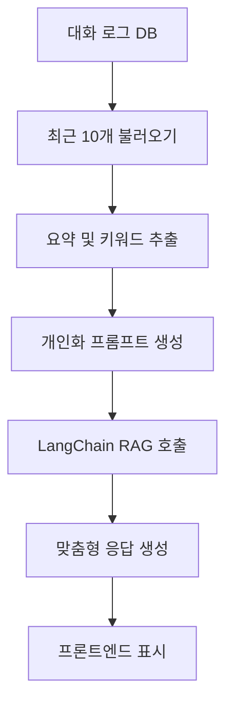

아주 좋아요 👏
이제 드디어 **6주차 – “AI가 나를 이해하고, 맞춤형으로 대답하는 단계”**입니다.

여기까지 오면 단순한 챗봇이 아니라
→ **“기억 기반 개인화 AI 시스템”**으로 진화하게 돼요.
5주차에서 저장된 대화 로그를 기반으로
AI가 사용자별 “패턴, 관심사, 질문 스타일”을 학습하고
개인화된 응답을 생성하는 기능을 구현합니다.

---

# 🤖 Week 6 : 개인화 응답 & 추천 시스템

> 🎯 **목표:**
> 5주차에서 저장된 대화 로그를 활용해
> 사용자의 질문 맥락과 과거 패턴을 분석하고,
> 맞춤형 응답 또는 추천 결과를 제공한다.
>
> 🗓 **기간:** 6주차 (Day 36 ~ 42)
> 💡 **주제:** “AI가 나를 이해하고, 나만의 답을 준다”

---

## 📅 **6주차 일정표**

| Day           | 주요 목표       | 세부 내용                                                           | 결과물             |
| ------------- | ----------- | --------------------------------------------------------------- | --------------- |
| **36일차**      | 데이터 로딩      | - MySQL 로그 불러오기<br>- 최근 10개 대화 기반 사용자 맥락 구성                     | 과거 대화 불러오기 로직   |
| **37일차**      | 개인화 프롬프트 설계 | - “이전 대화 요약 + 현재 질문” 구조<br>- LangChain Memory or Custom Context | 사용자별 context 완성 |
| **38일차**      | 추천 로직 설계    | - 대화 주제별 분류<br>- 관련 문서나 정책 추천                                   | 개인화 추천 기능       |
| **39일차**      | FastAPI 통합  | - `/api/personal-chat` 엔드포인트 생성<br>- context-aware 응답 구현        | 개인화 API 완성      |
| **40일차**      | 벡터 기반 개인 기억 | - 사용자 로그를 벡터로 임베딩<br>- 유사 질문 검색 (FAISS/Chroma)                  | 유사 대화 검색 기능     |
| **41일차**      | UI 개선       | - React에서 “개인화 모드” 토글<br>- 맞춤 추천 결과 출력                          | 맞춤형 UI 완성       |
| **42일차 (회고)** | 테스트 & 문서화   | - 테스트, 회고 정리<br>- README에 개인화 구조 다이어그램 추가                       | 개인화 챗봇 완성       |

---

## ✅ **체크리스트**

* [ ] 최근 대화 로그 불러오기 로직 구현
* [ ] 사용자별 Context Prompt 구성
* [ ] `/api/personal-chat` API 생성
* [ ] LangChain Memory 또는 Custom Context 적용
* [ ] 사용자 로그 벡터 임베딩 (Chroma/FAISS)
* [ ] 유사 질문 검색 기능 추가
* [ ] 맞춤형 UI (추천/요약 결과 표시)
* [ ] README에 개인화 구조 다이어그램 추가

---

## 🧩 **개인화 로직 구조**



---

## 💻 **핵심 API 설계**

📁 `app/routers/personal_chat.py`

```python
from fastapi import APIRouter
from app.database import SessionLocal
from app.models.conversation_log import ConversationLog
from app.services.personalizer import generate_personal_answer

router = APIRouter()

@router.post("/personal-chat")
async def personal_chat(req: dict):
    question = req.get("question")
    db = SessionLocal()
    recent_logs = (
        db.query(ConversationLog)
        .filter(ConversationLog.user_id == "guest")
        .order_by(ConversationLog.created_at.desc())
        .limit(10)
        .all()
    )
    db.close()

    response = generate_personal_answer(question, recent_logs)
    return {"answer": response}
```

---

📁 `app/services/personalizer.py`

```python
from langchain.chat_models import ChatOpenAI
from langchain.schema import HumanMessage, SystemMessage

def summarize_context(logs):
    summaries = [f"Q: {l.question} / A: {l.answer}" for l in logs]
    return "\n".join(summaries)

def generate_personal_answer(question, logs):
    context = summarize_context(logs)
    messages = [
        SystemMessage(content="너는 사용자의 과거 대화를 이해하고 개인화된 답변을 주는 어시스턴트야."),
        HumanMessage(content=f"이전 대화 내용:\n{context}\n\n새로운 질문: {question}")
    ]
    llm = ChatOpenAI(model="gpt-4o-mini")
    response = llm(messages)
    return response.content
```

---

## 📘 **개인화 프롬프트 예시**

```
이전 대화 요약:
- 최근 사용자는 AI 커리어 전환 관련 질문을 여러 번 함
- 프론트엔드와 FastAPI 연동에 어려움을 느꼈음
- Chroma 임베딩과 DB 저장을 마침

새로운 질문:
“나의 AI 커리어 로드맵 2단계는 어떻게 확장해야 할까?”
```

➡️ AI는 과거 맥락을 반영한 대답을 생성:

> “지난주에 FastAPI와 React를 연결했죠. 이제 RAG 모델 확장 단계로 넘어가 보세요…”

---

## 🧠 **프론트엔드 개선 예시**

📁 `frontend/src/App.jsx`

```jsx
const [mode, setMode] = useState("normal");

return (
  <div>
    <label>
      <input
        type="checkbox"
        onChange={(e) => setMode(e.target.checked ? "personal" : "normal")}
      /> 개인화 모드
    </label>

    <textarea value={question} onChange={(e) => setQuestion(e.target.value)} />
    <button onClick={sendMessage}>질문 보내기</button>

    {mode === "personal" && <p>🤖 개인화 모드 ON</p>}
  </div>
);
```

---

## 🧮 **추가 확장 아이디어**

| 기능             | 설명                           |
| -------------- | ---------------------------- |
| 📈 “나의 주제 통계”  | 가장 많이 질문한 주제 TOP 3 표시        |
| 🧩 “AI 추천 기능”  | 과거 대화 기반 맞춤 정책/콘텐츠 추천        |
| 🔍 “유사 질문 검색”  | FAISS/Chroma로 최근 맥락 유사도 검색   |
| 🧠 “개인 벡터 메모리” | 각 사용자별 vectorstore 생성 및 업데이트 |
| 💬 “맞춤 인사/피드백” | 사용자의 톤 & 스타일 반영한 응답          |

---

## 🪞 **회고 템플릿**

> 🔹 AI가 나를 “기억”하고 “맞춤 답변”을 주니 어땠는가?
> 🔹 프롬프트 설계와 일반 응답의 차이를 느꼈는가?
> 🔹 개인화 기능을 어디에 확장할 수 있을까?
> 🔹 다음 단계(7주차)에는 어떤 인사이트 기능을 넣고 싶은가?

---

## 🏁 **6주차 종료 기준**

✅ DB에서 최근 대화 불러오기 성공
✅ 개인화 프롬프트 설계 및 작동
✅ `/api/personal-chat` 정상 동작
✅ 맞춤형 응답 출력 (맥락 반영됨)
✅ README에 개인화 구조 다이어그램 추가

→ **“AI가 나를 이해하는 단계” 완성 🎯**

