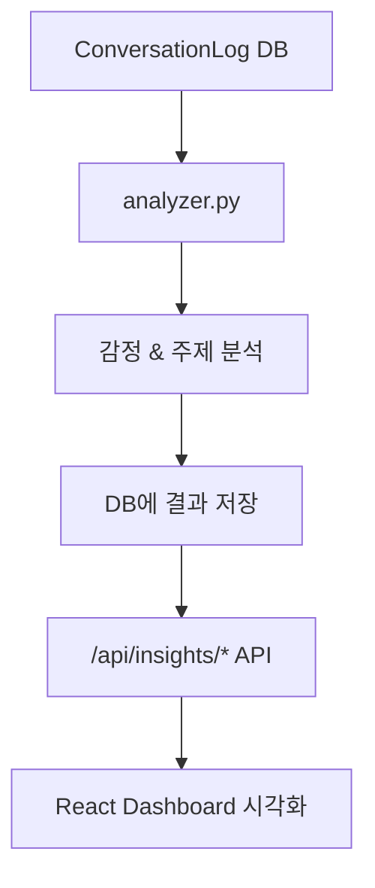

좋아요 👏 아주 정확한 포인트예요.
지금 상태는 **`app/services/analyzer.py` 파일만 존재**하고,
아직 “이 로직을 실제로 호출하거나 결과를 저장하는 단계”가 빠져 있습니다.

즉,
`analyzer.py`는 **“감정/주제 분석기”의 기능 정의만 되어 있고,
아직 “어디서 호출되는지” (즉, 파이프라인에 연결되는 부분)가 없는 상태**예요.

그래서 지금부터

> ✅ “어디서, 어떻게 analyzer를 호출할지”
> ✅ “분석 결과를 DB에 저장하고 API로 반환하는 구조”
> 를 단계별로 연결해드릴게요.

---

# 🧠 1️⃣ 구조 요약

현재 우리가 원하는 구조는 이렇게 돼요 👇



즉,

1. 대화가 DB에 저장됨 (`conversation_log`)
2. 이후 `analyzer.py` 가 이 로그들을 분석
3. 분석 결과(`sentiment`, `topic`)를 DB에 추가
4. `/api/insights/topics` 같은 API에서 이 데이터 조회 → 프론트에서 시각화

---

# 🧩 2️⃣ DB에 컬럼 추가하기

📁 `app/models/conversation_log.py`

```python
from sqlalchemy import Column, Integer, String, Text, DateTime, func
from app.database import Base

class ConversationLog(Base):
    __tablename__ = "conversation_log"

    id = Column(Integer, primary_key=True, index=True)
    user_id = Column(String(50), nullable=True)
    question = Column(Text, nullable=False)
    answer = Column(Text, nullable=False)
    sentiment = Column(String(20), nullable=True)  # ✅ 감정 결과
    topic = Column(String(100), nullable=True)     # ✅ 주제 결과
    created_at = Column(DateTime(timezone=True), server_default=func.now())
```

> ⚙️ 마이그레이션 없이 간단히 하려면 SQLite/MySQL에서 테이블을 지우고 다시 생성해도 됩니다.
> 예:
>
> ```bash
> DROP TABLE conversation_log;
> poetry run python -m app.database init
> ```

---

# 🧠 3️⃣ analyzer.py 로직 완성

📁 `app/services/analyzer.py`

```python
from langchain.chat_models import ChatOpenAI
from langchain.schema import HumanMessage

llm = ChatOpenAI(model="gpt-4o-mini")

def analyze_sentiment(text: str) -> str:
    """문장의 감정을 분석 ('긍정', '중립', '부정')"""
    prompt = f"다음 문장의 감정을 '긍정', '중립', '부정' 중 하나로 분류해줘:\n{text}"
    result = llm.invoke([HumanMessage(content=prompt)])
    return result.content.strip()

def extract_topic(text: str) -> str:
    """문장의 주요 주제 키워드 추출"""
    prompt = f"다음 문장에서 가장 중심이 되는 주제를 한 단어 또는 짧은 구로 요약해줘:\n{text}"
    result = llm.invoke([HumanMessage(content=prompt)])
    return result.content.strip()
```

---

# 🔄 4️⃣ 분석 로직을 호출하는 곳 연결

가장 자연스러운 위치는 “대화가 저장될 때”예요.
즉, `/api/rag-chat` 응답을 생성한 직후에 감정/주제 분석을 수행합니다.

📁 `app/routers/rag_chat.py`

```python
from app.services.analyzer import analyze_sentiment, extract_topic
from app.database import SessionLocal
from app.models.conversation_log import ConversationLog

@router.post("/rag-chat")
async def rag_chat(req: QueryRequest):
    question = req.question
    answer = generate_answer(question)  # 기존 RAG 응답 로직

    # ✅ 감정 / 주제 분석 추가
    sentiment = analyze_sentiment(answer)
    topic = extract_topic(answer)

    # ✅ DB 저장
    db = SessionLocal()
    log = ConversationLog(
        user_id="guest",
        question=question,
        answer=answer,
        sentiment=sentiment,
        topic=topic
    )
    db.add(log)
    db.commit()
    db.close()

    return {"answer": answer, "sentiment": sentiment, "topic": topic}
```

이제 챗봇이 응답할 때마다
자동으로 감정(`긍정/중립/부정`)과 주제(`AI`, `프론트엔드`, `커리어` 등)가 함께 저장됩니다 ✅

---

# 📊 5️⃣ `/api/insights/topics` API 만들기

📁 `app/routers/insights.py`

```python
@router.get("/insights/topics")
def get_topics():
    db = SessionLocal()
    results = (
        db.query(ConversationLog.topic, func.count().label("count"))
        .group_by(ConversationLog.topic)
        .order_by(func.count().desc())
        .limit(10)
        .all()
    )
    db.close()
    return [{"topic": r.topic, "count": r.count} for r in results]
```

이제 React에서 `/api/insights/topics`를 불러서
“주제별 대화 비율”을 PieChart나 BarChart로 시각화할 수 있습니다.

---

# 📈 6️⃣ 프론트엔드 시각화 예시

📁 `frontend/src/pages/Dashboard.jsx`

```jsx
import { useEffect, useState } from "react";
import axios from "axios";
import { PieChart, Pie, Cell, Tooltip, Legend } from "recharts";

export default function TopicsChart() {
  const [topics, setTopics] = useState([]);

  useEffect(() => {
    axios.get("/api/insights/topics").then((res) => setTopics(res.data));
  }, []);

  const colors = ["#60a5fa", "#34d399", "#fbbf24", "#f87171", "#a78bfa"];

  return (
    <div className="p-4">
      <h2 className="text-xl font-bold mb-2">🧩 주제별 대화 비율</h2>
      <PieChart width={400} height={300}>
        <Pie
          data={topics}
          dataKey="count"
          nameKey="topic"
          cx="50%"
          cy="50%"
          outerRadius={100}
          fill="#8884d8"
          label
        >
          {topics.map((_, i) => (
            <Cell key={i} fill={colors[i % colors.length]} />
          ))}
        </Pie>
        <Tooltip />
        <Legend />
      </PieChart>
    </div>
  );
}
```

---

# 💡 정리 요약

| 단계 | 파일                    | 기능                         |
| -- | --------------------- | -------------------------- |
| ①  | `conversation_log` 모델 | `sentiment`, `topic` 컬럼 추가 |
| ②  | `analyzer.py`         | 감정·주제 분석 로직 정의             |
| ③  | `rag_chat.py`         | 챗봇 응답 시 analyzer 호출        |
| ④  | `insights.py`         | 분석 결과를 집계해 API로 제공         |
| ⑤  | `Dashboard.jsx`       | 감정/주제 비율 시각화               |

---

# ✅ 이렇게 작동합니다

1️⃣ 사용자가 질문 → `/api/rag-chat` 호출
2️⃣ AI 응답 생성 후 → `analyzer.py` 실행
3️⃣ `sentiment`, `topic` DB에 저장
4️⃣ `/api/insights/topics` → 프론트 대시보드로 전달
5️⃣ React 차트에서 시각화

---

원하신다면 다음으로,
👉 “감정 변화 트렌드” (Positive/Neutral/Negative를 LineChart로 일자별 표시)
까지 연동된 예제도 만들어드릴까요?
이건 **감정 추세 그래프**를 만드는 7주차 확장 버전이에요.
