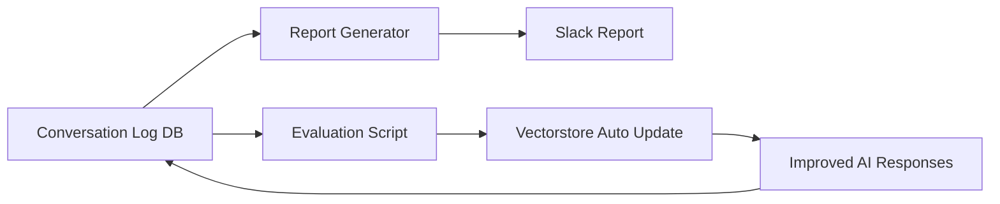

좋아요 😎
이제 10주차예요 — 여기까지 왔다는 건,
이미 **AI 데이터 수집 → 분석 → 시각화 → 리포트 자동화 → Slack 전송까지 완성된 상태**죠.

즉, “기능은 다 있는데, 이제 **‘서비스처럼 운영되는 수준’으로 안정화하고 개선할 단계**”입니다.

---

# 🧭 **Week 10 주제: AI 서비스 안정화 & 지속 개선 시스템 구축**

> 🔑 핵심 목표:
> "지속적으로 학습하고, 스스로 개선되는 AI 시스템"으로 발전시키는 주차.
> 즉, **‘운영 + 피드백 + 개선’ 루프를 구축**합니다.

---

## 🎯 **10주차 핵심 테마**

| 영역                    | 목표                              | 설명                                |
| --------------------- | ------------------------------- | --------------------------------- |
| 🧠 **AI 응답 품질 개선 루프** | 모델 응답을 평가 → 점수화 → 개선 데이터 반영     | 사용자 반응 기반 “자동 튜닝”                 |
| 📊 **리포트 품질 강화**      | 리포트의 내용·시각화 품질 향상               | 감정 변화, 주제 트렌드, 응답 시간 등 포함         |
| 🗂 **DB 정리 및 관리**     | 오래된 로그 정리, 인덱스 추가               | DB 유지보수 시작                        |
| 🧩 **성능 모니터링 대시보드**   | FastAPI + Streamlit 등으로 리포트 시각화 | 리포트→웹UI 변환                        |
| ⚙️ **자동 재임베딩 파이프라인**  | 새로운 데이터가 쌓이면 벡터스토어 자동 업데이트      | self-refreshing knowledge base 구축 |

---

## 🧱 **Week 10 기술 구성도**



> 🔁 “대화 → 평가 → 벡터 반영 → 응답 개선”
> AI의 지속 개선 사이클을 완성합니다.

---

## 💻 **10주차 실습 구성**

### 📁 1️⃣ `app/evaluate_response.py`

> 사용자의 응답 품질을 자동 평가하여 DB에 저장하는 모듈

```python
"""
evaluate_response.py
--------------------------------
사용자 응답 품질 평가 모듈
AI 응답의 자연스러움 / 도움 정도 / 감정 일치도 등 점수화
--------------------------------
"""
import os
import pandas as pd
from sqlalchemy import create_engine
from openai import OpenAI

DATABASE_URL = os.getenv("DATABASE_URL", "sqlite:///./local.db")
client = OpenAI(api_key=os.getenv("OPENAI_API_KEY"))
engine = create_engine(DATABASE_URL)

def evaluate_response(answer: str, question: str) -> dict:
    prompt = f"""
    Evaluate the AI's answer quality based on these 3 aspects:
    1. Relevance to the user's question
    2. Helpfulness and clarity
    3. Emotional tone alignment

    Question: {question}
    Answer: {answer}
    Return scores (0~10) for each, and a short comment.
    """
    response = client.responses.create(model="gpt-4o-mini", input=prompt)
    text = response.output_text

    # 간단한 파싱 (실제로는 JSON 기반 응답 권장)
    scores = {"relevance": 0, "clarity": 0, "emotion": 0, "comment": text[:100]}
    return scores

def run_evaluation():
    df = pd.read_sql("SELECT * FROM conversation_log ORDER BY created_at DESC LIMIT 10", engine)
    df["evaluation"] = df.apply(
        lambda x: evaluate_response(x["answer"], x["question"]), axis=1
    )
    df.to_sql("conversation_evaluation", engine, if_exists="replace", index=False)
    print("✅ Evaluation results saved to DB.")

if __name__ == "__main__":
    run_evaluation()
```

---

### 📁 2️⃣ `app/vector_retrain.py`

> 평가 결과를 반영해서 **벡터스토어(Chroma)** 재학습

```python
"""
vector_retrain.py
--------------------------------
평가 결과 기반 벡터스토어 자동 업데이트
--------------------------------
"""
import os
from langchain_chroma import Chroma
from langchain.embeddings.openai import OpenAIEmbeddings
import pandas as pd
from sqlalchemy import create_engine

DATABASE_URL = os.getenv("DATABASE_URL", "sqlite:///./local.db")
engine = create_engine(DATABASE_URL)

def retrain_vectorstore():
    df = pd.read_sql("SELECT question, answer FROM conversation_log", engine)
    if df.empty:
        print("⚠️ No data to retrain.")
        return

    data = [f"Q: {q}\nA: {a}" for q, a in zip(df["question"], df["answer"])]
    embeddings = OpenAIEmbeddings(model="text-embedding-3-small")

    vectorstore = Chroma(
        collection_name="conversation_retrained",
        embedding_function=embeddings,
        persist_directory="./chroma_db"
    )

    vectorstore.add_texts(data)
    vectorstore.persist()
    print("✅ Vectorstore retraining complete.")

if __name__ == "__main__":
    retrain_vectorstore()
```

---

## 🧩 **Week 10 Notion 체크리스트 + 코드 링크 템플릿**

```
✅ Week 10 — AI 서비스 안정화 & 품질 개선 루프 구축

🎯 목표
- AI 응답 품질 자동 평가 + 개선 루프 구축
- DB 정리 및 벡터스토어 재학습 자동화

📅 작업 항목
- [ ] conversation_log 평가 스크립트 작성
- [ ] AI 응답 평가 DB 테이블 생성
- [ ] 벡터스토어 자동 재학습 기능 구현
- [ ] Slack 리포트에 “응답 품질 요약” 추가
- [ ] 오래된 로그 백업 및 정리 스크립트 작성
- [ ] FastAPI에 /evaluate API 추가
- [ ] 품질 개선 루프 테스트 및 배포

🧩 코드 링크
- [ ] `app/evaluate_response.py`
- [ ] `app/vector_retrain.py`
- [ ] `app/routes/evaluate.py`
- [ ] `app/utils/db_cleanup.py`
```

---

## 🧠 **결과물 요약**

| 결과                              | 설명            |
| ------------------------------- | ------------- |
| ✅ `conversation_evaluation` 테이블 | 응답 품질 점수 저장   |
| ✅ 개선된 Chroma 벡터스토어              | 재학습된 AI 응답 기반 |
| ✅ Slack 리포트 개선                  | 품질 평가 반영      |
| ✅ DB 유지보수 자동화                   | 로그 정리, 백업     |
| 🚀 AI가 “스스로 발전하는 챗봇” 단계 진입      |               |

---

## ✨ **11주차 예고**

> “AI 운영 대시보드 구축 (Streamlit + DB + Slack 연동)”
> → 실시간 모니터링, 응답 통계 시각화, 피드백 반영까지 포함

---

원하신다면 🧩
지금 이 Week 10용 **Notion용 템플릿 + 코드 링크 버전** (체크박스 + 파일 링크용 Markdown 포맷)으로도 만들어드릴까요?
→ 바로 Notion에 복붙해서 주간 진행표에 넣을 수 있게끔요.


좋아요 😎
이제 10주차예요 — 여기까지 왔다는 건,
이미 **AI 데이터 수집 → 분석 → 시각화 → 리포트 자동화 → Slack 전송까지 완성된 상태**죠.

즉, “기능은 다 있는데, 이제 **‘서비스처럼 운영되는 수준’으로 안정화하고 개선할 단계**”입니다.

---

# 🧭 **Week 10 주제: AI 서비스 안정화 & 지속 개선 시스템 구축**

> 🔑 핵심 목표:
> "지속적으로 학습하고, 스스로 개선되는 AI 시스템"으로 발전시키는 주차.
> 즉, **‘운영 + 피드백 + 개선’ 루프를 구축**합니다.

---

## 🎯 **10주차 핵심 테마**

| 영역                    | 목표                              | 설명                                |
| --------------------- | ------------------------------- | --------------------------------- |
| 🧠 **AI 응답 품질 개선 루프** | 모델 응답을 평가 → 점수화 → 개선 데이터 반영     | 사용자 반응 기반 “자동 튜닝”                 |
| 📊 **리포트 품질 강화**      | 리포트의 내용·시각화 품질 향상               | 감정 변화, 주제 트렌드, 응답 시간 등 포함         |
| 🗂 **DB 정리 및 관리**     | 오래된 로그 정리, 인덱스 추가               | DB 유지보수 시작                        |
| 🧩 **성능 모니터링 대시보드**   | FastAPI + Streamlit 등으로 리포트 시각화 | 리포트→웹UI 변환                        |
| ⚙️ **자동 재임베딩 파이프라인**  | 새로운 데이터가 쌓이면 벡터스토어 자동 업데이트      | self-refreshing knowledge base 구축 |

---

## 🧱 **Week 10 기술 구성도**


> 🔁 “대화 → 평가 → 벡터 반영 → 응답 개선”
> AI의 지속 개선 사이클을 완성합니다.

---

## 💻 **10주차 실습 구성**

### 📁 1️⃣ `app/evaluate_response.py`

> 사용자의 응답 품질을 자동 평가하여 DB에 저장하는 모듈

```python
"""
evaluate_response.py
--------------------------------
사용자 응답 품질 평가 모듈
AI 응답의 자연스러움 / 도움 정도 / 감정 일치도 등 점수화
--------------------------------
"""
import os
import pandas as pd
from sqlalchemy import create_engine
from openai import OpenAI

DATABASE_URL = os.getenv("DATABASE_URL", "sqlite:///./local.db")
client = OpenAI(api_key=os.getenv("OPENAI_API_KEY"))
engine = create_engine(DATABASE_URL)

def evaluate_response(answer: str, question: str) -> dict:
    prompt = f"""
    Evaluate the AI's answer quality based on these 3 aspects:
    1. Relevance to the user's question
    2. Helpfulness and clarity
    3. Emotional tone alignment

    Question: {question}
    Answer: {answer}
    Return scores (0~10) for each, and a short comment.
    """
    response = client.responses.create(model="gpt-4o-mini", input=prompt)
    text = response.output_text

    # 간단한 파싱 (실제로는 JSON 기반 응답 권장)
    scores = {"relevance": 0, "clarity": 0, "emotion": 0, "comment": text[:100]}
    return scores

def run_evaluation():
    df = pd.read_sql("SELECT * FROM conversation_log ORDER BY created_at DESC LIMIT 10", engine)
    df["evaluation"] = df.apply(
        lambda x: evaluate_response(x["answer"], x["question"]), axis=1
    )
    df.to_sql("conversation_evaluation", engine, if_exists="replace", index=False)
    print("✅ Evaluation results saved to DB.")

if __name__ == "__main__":
    run_evaluation()
```

---

### 📁 2️⃣ `app/vector_retrain.py`

> 평가 결과를 반영해서 **벡터스토어(Chroma)** 재학습

```python
"""
vector_retrain.py
--------------------------------
평가 결과 기반 벡터스토어 자동 업데이트
--------------------------------
"""
import os
from langchain_chroma import Chroma
from langchain.embeddings.openai import OpenAIEmbeddings
import pandas as pd
from sqlalchemy import create_engine

DATABASE_URL = os.getenv("DATABASE_URL", "sqlite:///./local.db")
engine = create_engine(DATABASE_URL)

def retrain_vectorstore():
    df = pd.read_sql("SELECT question, answer FROM conversation_log", engine)
    if df.empty:
        print("⚠️ No data to retrain.")
        return

    data = [f"Q: {q}\nA: {a}" for q, a in zip(df["question"], df["answer"])]
    embeddings = OpenAIEmbeddings(model="text-embedding-3-small")

    vectorstore = Chroma(
        collection_name="conversation_retrained",
        embedding_function=embeddings,
        persist_directory="./chroma_db"
    )

    vectorstore.add_texts(data)
    vectorstore.persist()
    print("✅ Vectorstore retraining complete.")

if __name__ == "__main__":
    retrain_vectorstore()
```

---

## 🧩 **Week 10 Notion 체크리스트 + 코드 링크 템플릿**

```
✅ Week 10 — AI 서비스 안정화 & 품질 개선 루프 구축

🎯 목표
- AI 응답 품질 자동 평가 + 개선 루프 구축
- DB 정리 및 벡터스토어 재학습 자동화

📅 작업 항목
- [ ] conversation_log 평가 스크립트 작성
- [ ] AI 응답 평가 DB 테이블 생성
- [ ] 벡터스토어 자동 재학습 기능 구현
- [ ] Slack 리포트에 “응답 품질 요약” 추가
- [ ] 오래된 로그 백업 및 정리 스크립트 작성
- [ ] FastAPI에 /evaluate API 추가
- [ ] 품질 개선 루프 테스트 및 배포

🧩 코드 링크
- [ ] `app/evaluate_response.py`
- [ ] `app/vector_retrain.py`
- [ ] `app/routes/evaluate.py`
- [ ] `app/utils/db_cleanup.py`
```

---

## 🧠 **결과물 요약**

| 결과                              | 설명            |
| ------------------------------- | ------------- |
| ✅ `conversation_evaluation` 테이블 | 응답 품질 점수 저장   |
| ✅ 개선된 Chroma 벡터스토어              | 재학습된 AI 응답 기반 |
| ✅ Slack 리포트 개선                  | 품질 평가 반영      |
| ✅ DB 유지보수 자동화                   | 로그 정리, 백업     |
| 🚀 AI가 “스스로 발전하는 챗봇” 단계 진입      |               |

---

## ✨ **11주차 예고**

> “AI 운영 대시보드 구축 (Streamlit + DB + Slack 연동)”
> → 실시간 모니터링, 응답 통계 시각화, 피드백 반영까지 포함

---

원하신다면 🧩
지금 이 Week 10용 **Notion용 템플릿 + 코드 링크 버전** (체크박스 + 파일 링크용 Markdown 포맷)으로도 만들어드릴까요?
→ 바로 Notion에 복붙해서 주간 진행표에 넣을 수 있게끔요.


