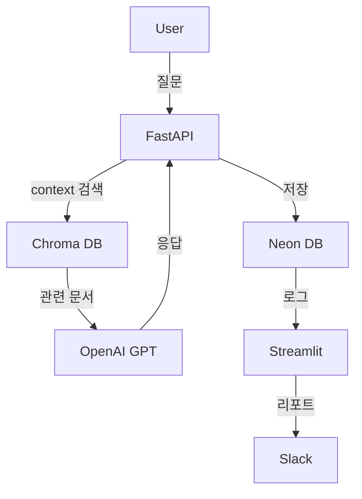

좋아요 👏
이제 **Week 16**은 이 “AI 커리어 전환 6개월 프로젝트”의 **마무리 단계**입니다.
앞선 15주 동안 시스템은 완성되었고,
이번 주는 **정리, 포트폴리오화, 배포 안정화, 그리고 커리어 포지셔닝**을 목표로 합니다.

---

# 🧭 **Week 16 — 최종 정리 & AI 커리어 포트폴리오 완성**

> “이제 이 프로젝트를 **이력서에 쓸 수 있는 완성된 작품**으로 만든다.”

---

## 🎯 **이번 주 핵심 목표**

| 영역             | 목표                                      | 세부 내용                                  |
| -------------- | --------------------------------------- | -------------------------------------- |
| 📁 코드 정리       | 전체 프로젝트 리팩토링 및 폴더 구조 정리                 | README, requirements, env, sample data |
| 🧾 문서화         | 기술 문서, 시스템 구성도, ERD, API 명세 자동화         | Markdown, draw.io, Mermaid             |
| 📊 포트폴리오화      | GitHub / Notion용 발표용 README 작성          | 핵심 기능 + 시각 자료                          |
| 🚀 배포 안정화      | Render + Neon + Slack + Streamlit 최종 점검 | env 관리, health check                   |
| 🧠 회고 및 커리어 연결 | 배운 점 + 적용 가능한 직무 정의                     | AI Ops / Data Engineer / MLOps 관점 정리   |

---

## 📁 **폴더 구조 (최종 정리 예시)**

```
ai-career-6months/
 ┣ app/
 ┃ ┣ __init__.py
 ┃ ┣ main.py
 ┃ ┣ routes/
 ┃ ┣ utils/
 ┃ ┣ models/
 ┃ ┗ scheduler_monitor.py
 ┣ dashboards/
 ┃ ┗ admin_dashboard.py
 ┣ reports/
 ┣ docs/                      👈 📘 새로 추가 (문서용)
 ┃ ┣ architecture.png
 ┃ ┣ system_flow.mmd
 ┃ ┣ api_reference.md
 ┃ ┗ project_summary.md
 ┣ .env.example
 ┣ pyproject.toml
 ┣ README.md
 ┗ render.yaml
```

---

## 🧱 **1️⃣ 코드 리팩토링 및 주석 정리**

* 모든 `utils` / `routes` 모듈에 **파일 헤더 주석 추가**
* 불필요한 `print` → `logging` 으로 통일
* `__init__.py` 추가해 import 경로 명확화
* `requirements.txt` or `poetry export` 로 종속성 명시

예시:

```bash
poetry export -f requirements.txt --output requirements.txt --without-hashes
```

---

## 📘 **2️⃣ 프로젝트 문서화 (`docs/` 폴더)**

### 🧩 1) 시스템 구성도 (Mermaid)

📄 `docs/system_flow.mmd`



### 🧩 2) API 명세 (`docs/api_reference.md`)

```markdown
# API Reference

## POST /ask
- Description: 사용자 질문에 대해 AI 답변 생성
- Request: `{ "question": "오늘 날씨 어때?" }`
- Response: `{ "answer": "맑고 따뜻한 날씨입니다." }`

## GET /run-feedback-loop
- Description: 피드백 기반 재학습 루프 실행
- Response: `{ "status": "Feedback loop started" }`
```

---

## 🧾 **3️⃣ README.md (포트폴리오용 완성 버전)**

```markdown
# 🤖 AI Career 6 Months

> 개인 AI 역량 전환을 위한 6개월 실전 프로젝트  
> FastAPI + LangChain + Chroma + Streamlit + Slack Integration

---

## 🚀 Features
- AI RAG 기반 대화형 엔진 (LangChain + Chroma)
- 감정 분석 및 피드백 자동 학습 루프
- Slack 리포트 자동화 + Dashboard 시각화
- 주간/월간 리포트 자동 생성 및 전송
- FastAPI REST 서버 + Streamlit Admin Panel

---

## 🧩 Tech Stack
| Layer | Technology |
|--------|-------------|
| Backend | FastAPI, LangChain, SQLAlchemy |
| Database | Neon (PostgreSQL), Chroma |
| Frontend | Streamlit (Admin Dashboard) |
| Automation | schedule, cron-job.org, Slack API |
| DevOps | Render Deploy, Poetry, .env |

---

## 📊 Architecture


---

## 📈 Example Slack Report
```

📈 AI 성능 개선 리포트

* 이번주 평균 점수: 8.3
* 지난주 평균 점수: 7.5
* 변화율: +10.7%

```

---

## 🧠 Career Note
이 프로젝트는 AI Assistant의 **운영 자동화 및 피드백 학습 시스템**으로,
AI Ops / MLOps / 데이터 엔지니어링 직무 포트폴리오로 활용 가능합니다.
```

---

## ⚙️ **4️⃣ 배포 및 점검**

1️⃣ Render Logs 확인 (`uvicorn`, `schedule`, `Slack`)
2️⃣ Neon 연결 테스트 (`psql`, SELECT 테스트)
3️⃣ Slack 리포트 / Dashboard 정상 동작
4️⃣ `.env.example` 에 환경 변수 문서화

---

## 🧩 **5️⃣ 커리어 회고 (Notion 템플릿)**

```
🧠 Week 16 — 커리어 회고 & 포트폴리오 정리

🎯 배운 점
- LangChain RAG 파이프라인 설계 경험
- AI Feedback Loop 자동화 구현
- Slack / Dashboard 운영 시스템 설계

💪 성장 포인트
- 백엔드/AI/자동화 전체 아키텍처 경험
- DevOps 파이프라인 구축 경험
- 실시간 모니터링/리포트 자동화 기술력 확보

🎯 적용 직무
- AI Ops Engineer
- MLOps / 데이터 파이프라인 엔지니어
- AI 서비스 백엔드 개발자

📦 결과물
- GitHub Repository: [ai-career-6months](https://github.com/you/ai-career-6months)
- Demo Dashboard: https://yourapp.onrender.com
- Slack Demo Channel: #ai-reports
```

---

## ✅ **Week 16 Notion 체크리스트 + 코드 링크**

```
✅ Week 16 — 최종 정리 & 포트폴리오 완성

🎯 목표
- 코드/문서/리포트/배포 완성
- 커리어 포트폴리오 구성 및 README 작성
- 프로젝트 아카이브 정리

📅 작업 항목
- [ ] 전체 폴더 구조 리팩토링
- [ ] README.md 최종 포트폴리오용 작성
- [ ] docs/ 폴더 생성 (ERD, 구성도, 명세)
- [ ] render.yaml + .env.example 정리
- [ ] Slack / Dashboard / DB 최종 테스트
- [ ] Notion 회고 기록 작성

🧩 링크
- [ ] docs/system_flow.mmd
- [ ] docs/api_reference.md
- [ ] README.md
- [ ] dashboards/admin_dashboard.py
```

---

## 🧠 **한 줄 요약**

> “Week 16은 ‘운영 프로젝트’를 ‘커리어 포트폴리오’로 전환하는 주다.
> 이제 이 프로젝트는 이력서에 들어갈 수 있는 완성품이다.” ✅

---

원하신다면 🔥
이 Week 16용으로 “**Notion 포트폴리오 페이지 템플릿**”
(소개글 + 주요 기술 스택 + 시각 자료 + 성과 지표 자동 계산 포함)을 만들어드릴까요?
