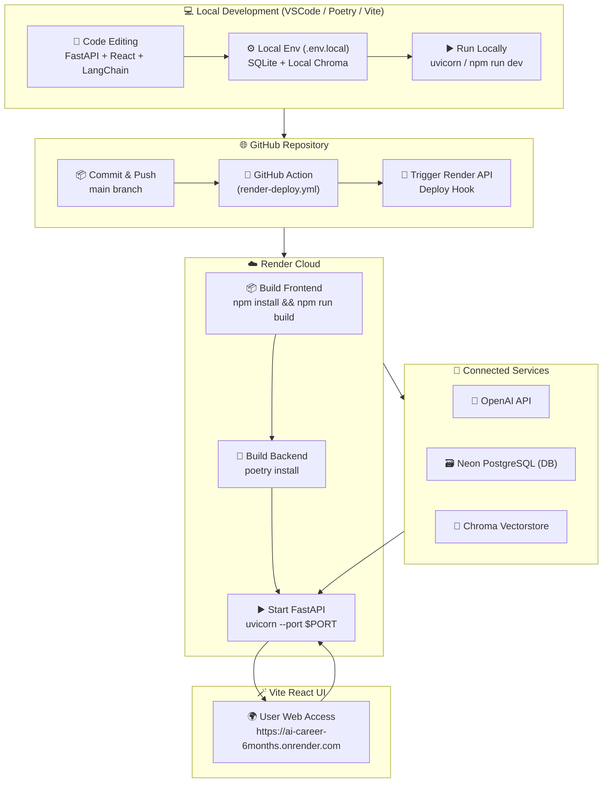

좋아요 😎
이제 완전한 마무리 단계입니다.
아래는 **GitHub README.md** 에 바로 붙여넣을 수 있는
📊 **Mermaid 다이어그램 + 배포 요약 표** 버전이에요.

이 다이어그램은
로컬 개발 → GitHub push → GitHub Action → Render → Neon DB / OpenAI / Chroma
까지의 전체 흐름을 한눈에 보여줍니다.

---

# 🧭 **AI Career 6 Months — Local → Cloud Workflow**

## 📈 Mermaid 다이어그램



---

## 🧩 **요약 흐름표**

| 단계          | 구성요소                                | 동작 내용                                                |
| ----------- | ----------------------------------- | ---------------------------------------------------- |
| ① 로컬 개발     | VSCode + Poetry + npm               | FastAPI / React 개발, 로컬 실행 (`uvicorn`, `npm run dev`) |
| ② Git Push  | GitHub main branch                  | 변경사항 commit → push                                   |
| ③ 자동 배포     | GitHub Action (`render-deploy.yml`) | Vite 빌드 + Preflight Check + Render API 호출            |
| ④ Render 빌드 | `render.yaml` 기반                    | `npm run build` + `poetry install` + `uvicorn` 실행    |
| ⑤ 클라우드 실행   | Render Web Service                  | `/` → React UI, `/health` → 상태 점검                    |
| ⑥ 백엔드 통합    | FastAPI 서버                          | OpenAI / Neon / Chroma 연동                            |
| ⑦ 사용자 접속    | 웹 브라우저                              | React 앱 UI에서 AI 응답 확인 가능                             |

---

## 🌍 **Render 환경 구조**

```
/opt/render/project/src/
 ┣ app/
 ┃ ┣ main.py
 ┃ ┣ config.py
 ┃ ┗ database.py
 ┣ frontend/
 ┃ ┗ dist/       ← npm run build 결과
 ┣ chroma_db/
 ┣ .env.prod
 ┣ pyproject.toml
 ┗ render.yaml
```

---

## 🔄 **배포 트리거 구조**

| 트리거             | 동작                                             |
| --------------- | ---------------------------------------------- |
| `git push main` | GitHub Action 실행                               |
| `GitHub Action` | Render API 호출 (`RENDER_API_KEY`, `SERVICE_ID`) |
| `Render`        | npm + poetry 빌드                                |
| `FastAPI`       | `/health` 응답 확인 가능                             |
| `Frontend`      | Vite React 앱 자동 연결 (`frontend/dist`)           |

---

## 🧠 **데이터 흐름**

| 구성요소                  | 역할            | 데이터              |
| --------------------- | ------------- | ---------------- |
| **FastAPI (Backend)** | API 처리, DB 관리 | 유저 요청 / 응답       |
| **React (Frontend)**  | 사용자 UI        | AI 대화창 표시        |
| **OpenAI**            | 모델 응답 생성      | 텍스트, 요약, 분석      |
| **Neon PostgreSQL**   | 영구 DB         | 대화 로그 / 감정 분석 결과 |
| **Chroma**            | 벡터 스토리지       | 문서 임베딩 / 검색      |
| **GitHub Action**     | CI/CD 자동화     | 코드 → 배포 파이프라인    |

---

## ✅ **개발–배포–운영 루틴**

| 구분          | 로컬 환경                           | Render 환경                                       |
| ----------- | ------------------------------- | ----------------------------------------------- |
| 실행 명령       | `uvicorn app.main:app --reload` | 자동 실행 (`uvicorn --port $PORT`)                  |
| DB          | SQLite                          | Neon PostgreSQL                                 |
| Vectorstore | Local Chroma                    | Persistent Chroma (`./chroma_db`)               |
| OpenAI Key  | `.env.local`                    | Render Env Var                                  |
| 배포 트리거      | 수동 (`git push`)                 | 자동 (`render.yaml` + API)                        |
| 상태 확인       | `http://127.0.0.1:8000/health`  | `https://ai-career-6months.onrender.com/health` |

---

## 🏁 **완성된 DevOps 루프**

1️⃣ 로컬에서 실험 (`uvicorn` + `npm run dev`)
2️⃣ 변경 사항 push → GitHub Action 자동 실행
3️⃣ Render가 자동 빌드 & 배포
4️⃣ 배포된 서비스 URL에서 바로 확인 (`/`, `/health`)
5️⃣ FastAPI ↔ Neon ↔ OpenAI ↔ Chroma 완전 통합
6️⃣ 로그 및 감정 분석까지 클라우드 상에서 자동 저장

---

이제 README에 이 블록을 추가하면
프로젝트가 **“하이브리드 AI 클라우드 서비스 아키텍처”** 형태로 완전히 시각화됩니다 💡

---

원하신다면 🔧
이 Mermaid 다이어그램을 **Render 배포 후 README에서 자동 렌더링 (SVG 생성)** 하도록
GitHub Action으로 자동 변환해드릴까요?
→ README에서 다이어그램이 이미지처럼 표시되도록 (`mermaid-cli`)
